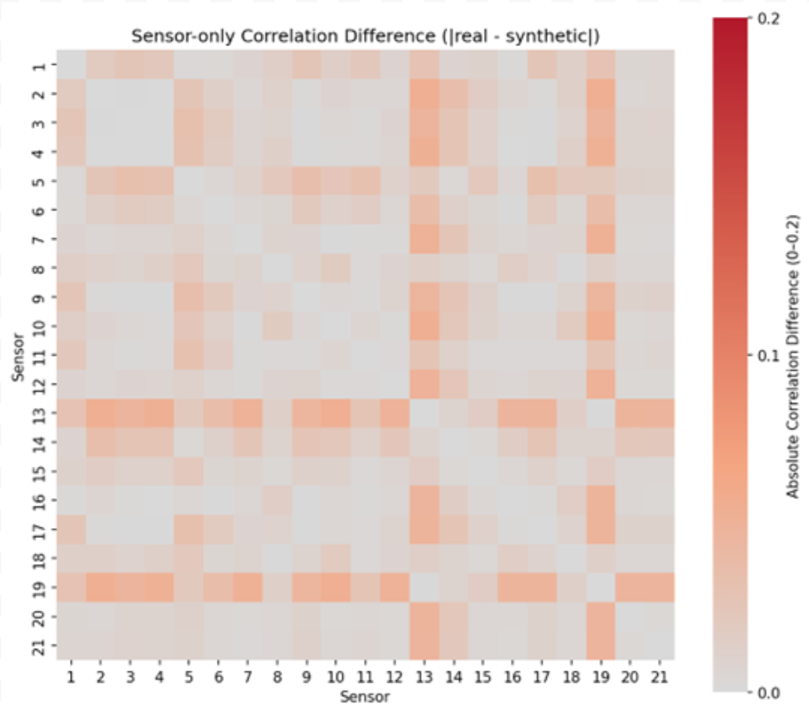
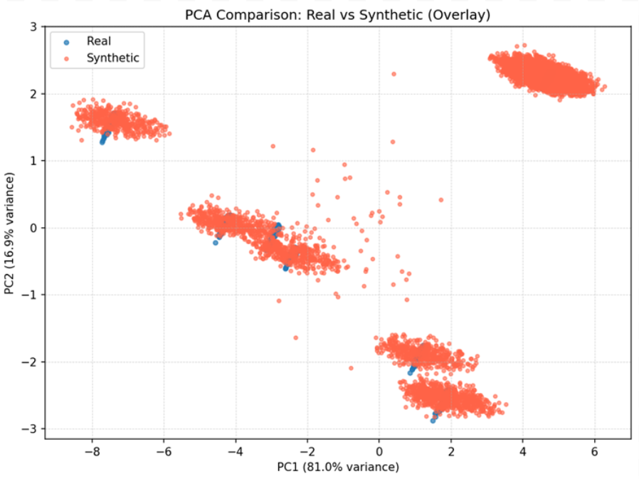

## Engine Data Synthesizer – Purdue Data Mine Collaboration with Rolls-Royce

### Project Duration – 
  August - December 2025

### Project Overview – 
  I was part of a team in the Purdue Data Mine that collaborated with Rolls-Royce’s prognostics and health management (PHM). We were tasked with designing a synthetic data generator for turbofan engines, which are used to predict the remaining lifespan of the batch of engines from the data provided.

### Objectives –
  - Generate synthetic data taken from the real data of turbofan engine sensors.
  - Determine if the transformer model is feasible in generating data from engine sensors given the conditions required.

### Personal Role – 
  On my subteam, we used the transformer model to capture temporal relationships across multi-sensor engine data. The model was programmed in Python with matplot and torch as the main libraries. The synthetic data generated would then be compared with actual engine data that was provided to us, and a correlation matrix and PCA charts will be generated along with data graphs for each sensor in one line of engine data.

### Correlation Matrix –

Correlation matrix that shows the difference between all the sensors in the data we trained on compared to the data generated by the model (lighter color means closer correlation)

### PCA Analysis Graph –

PCA graph showing distribution of real data given to train the model and the synthetic data generated by the model

### Results –
  - Despite computational and data-access constraints, the model produced meaningful correlations that demonstrated feasibility of the approach. (limited computing power, no access to industrial resources)
  - Presented our findings to Rolls-Royce engineers
